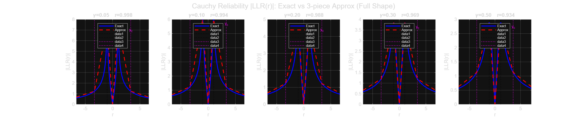
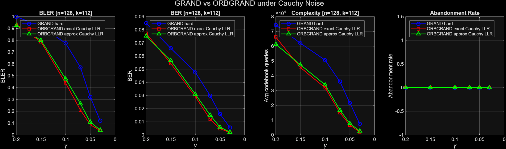
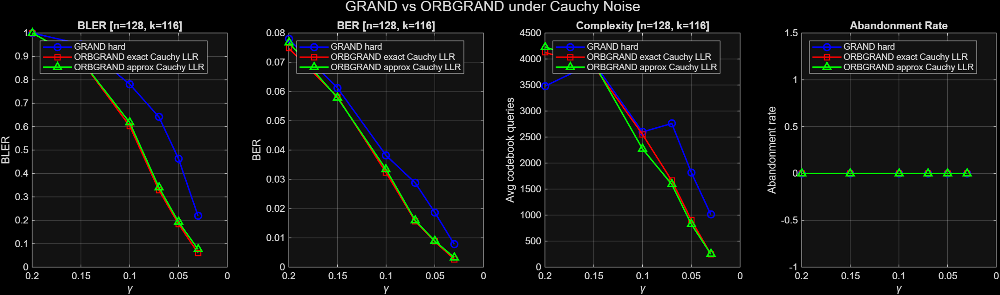

# ORBGRAND under Cauchy Noise — Cauchy LLR Approximation
# Tony Abi Haidar - VIP 301A

This repository extends the [GRAND-MATLAB](https://github.com/kenrduffy/GRAND-MATLAB) codebase by Ken R. Duffy (MIT) to support **soft-decision ORBGRAND decoding under additive Cauchy (impulsive) noise**, including a 3-piece piecewise-linear approximation of the Cauchy log-likelihood ratio (LLR) that enables hardware-efficient soft decoding without computing the exact LLR at runtime.

---

## Background

**GRAND (Guessing Random Additive Noise Decoding)** is a universal decoder that works with any linear code by guessing noise patterns in likelihood order and testing whether subtracting each guess yields a valid codeword. **ORBGRAND** (Ordered Reliability Bits GRAND) is its soft-decision variant: it sorts received bits by their reliability (|LLR|) and queries noise patterns in increasing *logistic weight* order, visiting the most likely error patterns first.

Standard ORBGRAND implementations assume **AWGN**, where the LLR is simply linear in the received signal. Under **Cauchy noise** — a heavy-tailed impulsive model — the LLR has a fundamentally different shape: it rises to a peak and then *decreases* for large received values, since extreme samples are likely noise outliers rather than strong signal. Ignoring this and using an AWGN-matched LLR in a Cauchy environment degrades decoding performance.

---

## Base Code: GRAND-MATLAB

The MATLAB simulation infrastructure used here is built on top of:

> **Ken R. Duffy, "GRAND-MATLAB"**
> [https://github.com/kenrduffy/GRAND-MATLAB](https://github.com/kenrduffy/GRAND-MATLAB)
> Licensed under the GRAND Codebase Non-Commercial Academic Research Use License (2022).

The upstream repository provides:
- `bin_GRAND.m` — hard-decision GRAND (Hamming-weight-ordered noise guessing)
- `bin_ORBGRAND.m` — soft-decision ORBGRAND using the Landslide algorithm
- `bin_ORBGRAND1.m` — 1-line ORBGRAND variant
- `landslide.m` — core combinatorial pattern generator for ORBGRAND
- `make_RLC.m` — Random Linear Code generator
- `make_CRC_GH.m`, `make_pac_code.m`, `koopman2matlab.m` — code construction utilities
- `driver_GRAND.m` — baseline AWGN simulation driver

The upstream code and everything derived from it remain under the upstream license (`GRAND Codebase Non-Commercial Academic Research Use License 021722.pdf`); see `README_UPSTREAM.md` for the original documentation.

---

## What Was Added in This Work

All new files were written from scratch and are entirely original contributions. The existing upstream files (`bin_GRAND.m`, `bin_ORBGRAND.m`, etc.) were audited, verified correct for the Cauchy setting, and thoroughly annotated but not modified in logic.

### New MATLAB Files

#### `cauchy_llr_approx.m`
The central contribution. Implements a **3-piece piecewise-linear approximation** of the signed Cauchy LLR:

```
R_approx(y) = c1·y + c2·max(0, y−t1) + c3·max(0, y−yc)
```

where:
- **t1 = √(1 + γ²)** — the analytically exact reliability peak (where dR/dy = 0)
- **yc** — the tail crossover point, defined as the *last* y where |R′(y)| = 0.1 · |R′(0)|

Key implementation decisions:
- The `yc` breakpoint must be selected as the **last** crossing of the slope threshold (not the first), because the derivative |R′(y)| rises and then falls past the peak, giving two crossings. Using the first one collapses Segment 2 and produces an essentially flat approximation — a critical bug that was identified, analysed, and fixed.
- Coefficients are computed analytically from the breakpoints, not by fitting.
- A persistent cache avoids recomputing breakpoints when the same γ is used repeatedly.

#### `cauchy_llr_piecewise.m`
An earlier prototype version of the 3-piece fit, implementing a tangent-based Segment 3 instead of the analytically matched slope used in `cauchy_llr_approx.m`. Retained for comparison.

#### `driver_GRAND_Cauchy_comparison.m`
Monte Carlo simulation comparing three decoders head-to-head over a **[128, 112] Random Linear Code** under BPSK + Cauchy noise across a sweep of γ values:
1. **Hard GRAND** — Hamming-weight ordering, no soft information
2. **ORBGRAND with exact Cauchy LLR** — full soft decoding with exact LLR
3. **ORBGRAND with approximate Cauchy LLR** — soft decoding with the 3-piece approximation

Outputs: BLER, BER, average codebook queries (complexity), abandonment rate, and demodulation error rate per decoder per γ. Saves results and generates a 4-panel comparison figure.

#### `driver_GRAND_Cauchy.m`
Single-decoder simulation driver for exploratory runs. Selects one decoder (GRAND or ORBGRAND) and one reliability type (exact or approx) at a time. Useful for debugging or profiling individual configurations.

#### `validate_cauchy_approx.m`
Standalone validation of `cauchy_llr_approx.m` with two independent tests:
- **Visual shape validation** — plots exact vs approximate R(y) over γ ∈ {0.05, 0.1, 0.2, 0.3, 0.5}, with Kendall's τ rank correlation reported per γ
- **Stratified Monte Carlo ordering test** — for each γ, draws 10,000 Cauchy samples and measures the fraction of randomly chosen pairs (i, j) for which the exact and approximate reliabilities agree on ordering, separately in three regions:
  - Region A [0, t1]: the rising segment (most critical for ORBGRAND)
  - Region B [t1, yc]: the steep descent through the outlier zone
  - Region C [yc, 10·yc]: the flat far tail

#### `checking_cauchy_ranking.m`
Block-level ranking comparison between exact and approximate Cauchy LLR across 500 random received blocks per γ. Reports per-block Spearman and Kendall rank correlations and overlap of the 10 and 20 least-reliable bits between exact and approximate orderings — the bits that ORBGRAND queries first.

#### `plot_cauchy_results.m`
Post-processing script that loads saved comparison results and generates publication-quality BLER, BER, and complexity figures.

#### `plot_cauchy_reliability.m`, `plot_awgn_reliability.m`, `plot_lwgn_reliability.m`
Companion scripts plotting the average sorted-reliability profile E[|LLR|_(j)] for j = 1…n under Cauchy, Gaussian (AWGN), and Laplacian noise respectively. These highlight the qualitative differences between noise models and motivate using noise-matched LLRs in ORBGRAND.

---

### Python Notebooks

Two Jupyter notebooks were developed in parallel with the MATLAB work for exploratory analysis and visualisation.

#### `Cauchy_VIP.ipynb`
Exploration of approximation models for the **empirical sorted-reliability profile** (the average sorted |LLR| across many Monte Carlo frames, as a function of normalised rank j/n). This is a different representation of reliability from the per-sample LLR approximation in `cauchy_llr_approx.m` — here the curve being approximated is the *statistical profile* rather than the pointwise function R(y).

Sections covered:
- **Cauchy Reliability Curves** — Monte Carlo generation of E[|LLR|_(j)] for n = 128 across multiple SNR/γ values, including the high-SNR regime
- **Different Types of Approximations** — systematic comparison of closed-form fits to the reliability profile:
  - Linear, quadratic, cubic, biquadratic polynomial fits (via `np.polyfit`)
  - Nonlinear fits: rational a·x/(b+x), saturating exponential a·(1−e^{−bx}), arctan a·arctan(b·x), logarithmic a·log(1+b·x)
  - Arctan extrapolation test: fit on the first 20% of the rank axis, evaluate on the remaining 80%
  - Hybrid piecewise: log/arctan on the rising segment, quadratic on the tail
- **Piecewise Linear Approximations** (working directly in normalised-rank space):
  - Two-slope, three-slope, and four-slope continuous piecewise linear fits via linear least squares grid search
  - Minimax (L∞) 3-slope fit via linear programming (scipy.optimize.linprog)

#### `CauchyReliabilityApprox.ipynb`
Analytical study of the **pointwise reliability function R(y)** and the design of its piecewise linear approximation — directly corresponding to the theory behind `cauchy_llr_approx.m`.

Sections covered:
- **Plot Cauchy Reliability Curve** — visualisation of R(y) = |L(y)| for γ ∈ {0.25, 0.5, 1, 2, 5, 10}, showing the non-monotone shape unique to Cauchy noise
- **Finding L″(y) = 0** — analytical and numerical computation of the inflection points of L(y), which are natural breakpoint candidates for the piecewise approximation
- **Trying Points** — geometric exploration of candidate analytical breakpoints (t1, y_b, y_i, y_g) plotted on R(y)
- **Slope threshold curves** — finding where R′(y) = −C/(1 + γ²) for various C, connecting to the ε = 0.1 threshold used in `cauchy_llr_approx.m`
- **Three-Piece Linear Fit on R(y)**:
  - MSE-minimising grid-search approach (fixing t1 analytically, optimising t2)
  - Continuity-constrained fit using `scipy.optimize.minimize_scalar`
- **Maximum Curvature** — curvature k(y) = |L″(y)| / (1 + L′(y)²)^{3/2} as an alternative breakpoint selection criterion
- **Piecewise Using Thresholds** — the ε-threshold criterion for t2, optimal C search across γ values, and comparison of exact vs approximate sorted-reliability profiles
- **Laplace LLR** — the Laplacian reliability curve for comparison, illustrating the key contrast: Laplacian |LLR| saturates for |y| > 1 while Cauchy |LLR| decays — motivating distinct noise-matched decoders

---

## Results

All simulations use BPSK over additive Cauchy noise with a random linear code (RLC), comparing hard-decision GRAND against ORBGRAND driven by the exact Cauchy LLR and by the 3-piece approximation. Smaller γ means a cleaner channel.

### The approximation preserves the ordering ORBGRAND needs



ORBGRAND only uses the *rank order* of bit reliabilities, so the target is ordering fidelity rather than pointwise accuracy. With the corrected tail breakpoint `yc`, Kendall's τ between exact and approximate reliabilities stays **≥ 0.93** for γ ∈ {0.05, 0.10, 0.20, 0.30, 0.50} (0.998 at γ = 0.05 down to 0.934 at γ = 0.50).

### Decoding performance, [128, 112] RLC



| γ | GRAND (hard) BLER | ORBGRAND exact BLER | ORBGRAND approx BLER |
|---|---|---|---|
| 0.03 | 0.120 | 0.037 | 0.041 |
| 0.05 | 0.321 | 0.086 | 0.108 |
| 0.07 | 0.571 | 0.210 | 0.264 |
| 0.10 | 0.775 | 0.439 | 0.474 |
| 0.15 | 0.917 | 0.787 | 0.800 |

Soft decoding with a Cauchy-matched LLR cuts the block error rate by up to **~3.7×** relative to hard-decision GRAND (γ = 0.05), and the 3-piece approximation keeps most of that gain (~3.0×) while also needing fewer codebook queries than hard GRAND across the sweep. Numbers are from `RESULTS/CAUCHY_comparison_ORBGRAND_RLC_128_112_1.mat`.

### Decoding performance, [128, 116] RLC



The higher-rate code shows the same ordering: both ORBGRAND variants track each other closely and sit well below hard GRAND in BLER, BER, and query count, with no abandonments.

---

## Repository Layout

```
GRAND_Code/          decoders, code constructors, and all Cauchy drivers / validation scripts
RESULTS/             saved simulation results (.mat); upstream sample results are unchanged
figures/             final figures shown above
reliability_plots/   sorted-reliability profiles under Cauchy, AWGN, and Laplacian noise
notebooks/           Python exploration notebooks (outputs included)
README_UPSTREAM.md   the original GRAND-MATLAB README
```

---

## Channel Model and Key Formulas

**BPSK over Cauchy noise:**
```
r = (1 − 2c) + z,    z ~ Cauchy(0, γ),    c ∈ {0, 1}
```
Cauchy noise is sampled as `z = γ · tan(π · (U − 0.5))`, with U ~ Uniform(0,1).

**Exact Cauchy LLR:**
```
L(r) = log(γ² + (r+1)²) − log(γ² + (r−1)²)
```

**Reliability:**
```
R(y) = |L(y)|,    y = |r|
```
R(y) peaks at **t1 = √(1 + γ²)** and decays to zero as y → ∞.

**3-piece approximation:**
```
R_approx(y) = c1·y + c2·max(0, y−t1) + c3·max(0, y−yc)
```
with analytically computed coefficients c1, c2, c3 and breakpoints t1 (exact peak) and yc (slope-threshold tail crossover).

---

## How to Run

Run the MATLAB scripts from inside `GRAND_Code/` (they read and write `../RESULTS/`). The reliability-profile scripts live in `reliability_plots/` and the notebooks in `notebooks/`.

**MATLAB — three-decoder comparison:**
```matlab
driver_GRAND_Cauchy_comparison   % runs, saves results, generates figure
```

**MATLAB — single decoder:**
```matlab
% Edit DECODER and RELIABILITY inside the file, then run:
driver_GRAND_Cauchy
```

**MATLAB — validation:**
```matlab
validate_cauchy_approx           % shape + ordering preservation tests
checking_cauchy_ranking          % block-level ranking metrics
```

**Python notebooks:**
Open `Cauchy_VIP.ipynb` or `CauchyReliabilityApprox.ipynb` in Jupyter and run all cells in order. Requires: `numpy`, `matplotlib`, `scipy`.

---

## References

- K. R. Duffy, J. Li, and M. Médard, "Capacity-achieving guessing random additive noise decoding," *IEEE Trans. Inf. Theory*, vol. 65, no. 7, pp. 4023–4040, 2019.
- K. R. Duffy, W. An, and M. Médard, "Ordered reliability bits guessing random additive noise decoding," *IEEE Trans. Signal Process.*, vol. 70, pp. 4528–4542, 2022.
- M. Rowshan, E. Viterbo, "Laplacian ORBGRAND decoding for impulsive noise," *IEEE MILCOM*, 2024.
- K. R. Duffy, "GRAND-MATLAB," GitHub, [https://github.com/kenrduffy/GRAND-MATLAB](https://github.com/kenrduffy/GRAND-MATLAB).

---
